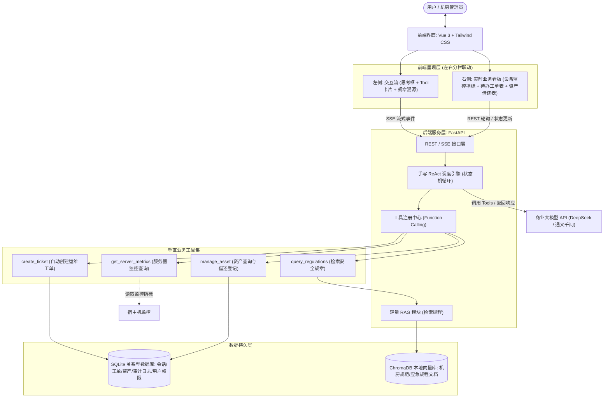
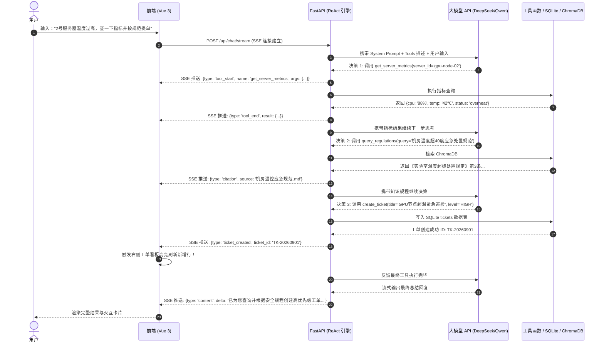

# 系统设计与快速落地架构规划方案

**系统定名**：基于轻量级 ReAct 架构的智能自治运维系统（LabOps-Agent）  
**应用场景**：高校机房与实验室 IT 基础设施智能自治运维  
**设计原则**：极简至上 (KISS)、第一性原理、业务状态闭环、原生白盒化

---

## 一、 系统定位与核心设计哲学

### 1.1 选题背景与价值
高校计算机学院实验室及机房普遍面临：设备资产台账分散、服务器健康监控分散、机房安全规章繁琐、报修派单依赖人工等痛点。  
本项目研发面向高校机房运维场景的垂直 Agent 系统，具备**感知**（监控指标采集）、**推理决策**（基于机房安全规范规章 RAG 研判）、**执行闭环**（自主创建检修工单、资产借还变更）与**操作审计**全流程能力。

### 1.2 拒绝“无状态套壳”的核心工程设计
在实际智能化运维场景中，最忌讳的是“仅输入一段话丢给模型输出一段话”的无状态系统。本项目通过以下 4 项硬核软件工程指标筑起技术壁垒：
1. **业务状态闭环（双向联动）**：Agent 执行结果不只是文字气泡，而是真实写入关系型数据库（SQLite）。前端采用**左右分栏联动设计**，左侧发起“排查 2 号机房 GPU 服务器”，右侧“实时工单看板”立刻同步新增一条带有工单号、预警等级与排查建议的工单。
2. **白盒化推理与状态机**：不采用任何庞大封装框架（如 LangChain），由手写约 150 行标准的 ReAct（Reasoning + Acting）状态机循环。系统架构可直接清晰展示状态转移图与算法流转，完全体现第一性原理。
3. **细粒度 SSE 流式渲染**：前端将大模型的单向文本流解构为结构化事件流（`think` 思考过程、`tool_call` 工具调用卡片、`citation` 规章溯源徽章、`ticket_mutation` 业务变更事件），推理链条全透明展现。
4. **可落地工程交付**：包含基于 RBAC 规范的用户鉴权与资产防冒名借调闭环（SHA-256 加盐哈希防脱库、admin666 专属激活码提权防御、只读凭据锁定、学生借调权限拦截）、工具调用日志审计表、标准 `docker-compose.yml` 容器化部署、Nginx 反向代理，体现正规软件工程全生命周期。

---

## 二、 极简系统架构与数据流转

### 2.1 整体架构图


### 2.2 ReAct 状态机流转逻辑（无黑盒）


---

## 三、 模块划分与工程目录结构

采用前后端分离但同仓管理的单体轻量结构，零冗余组件，完全符合 KISS 原则：

```text
LabOps-Agent/
├── backend/
│   ├── app/
│   │   ├── __init__.py
│   │   ├── main.py                  # FastAPI 入口、CORS 与路由注册
│   │   ├── config.py                # 环境变量管理 (API_KEY, 数据库路径等)
│   │   ├── agent/
│   │   │   ├── __init__.py
│   │   │   ├── react_engine.py      # 核心手写状态机 (约 150 行，负责 while 调度大模型与工具)
│   │   │   └── prompts.py           # 角色 System Prompt (机房智能管家约束规则)
│   │   ├── tools/
│   │   │   ├── __init__.py
│   │   │   ├── registry.py          # 工具列表注册与 JSON Schema 转换器
│   │   │   ├── metric_tools.py      # 工具1: 节点状态/温湿度指标查询 (返回真实/模拟指标)
│   │   │   ├── ticket_tools.py      # 工具2: 运维工单增删改查
│   │   │   ├── asset_tools.py       # 工具3: 实验室设备台账借还处理
│   │   │   └── rag_tools.py         # 工具4: 机房管理规章检索工具
│   │   ├── rag/
│   │   │   ├── __init__.py
│   │   │   ├── vector_store.py      # ChromaDB 本地持久化封装与检索接口
│   │   │   └── loader.py            # 规章制度 Markdown/Text 快速分块向量化入库脚本
│   │   ├── db/
│   │   │   ├── __init__.py
│   │   │   ├── models.py            # SQLAlchemy 模型 (Ticket, Asset, AuditLog, ChatHistory, User)
│   │   │   └── session.py           # SQLite 数据库会话引擎
│   │   ├── schemas/
│   │   │   ├── user.py              # 用户注册、登录与演示卡片 Pydantic 模式
│   │   │   ├── ticket.py
│   │   │   └── asset.py
│   │   ├── api/
│   │   │   ├── __init__.py
│   │   │   ├── auth.py              # 用户注册登录与典型演示账号 REST API (admin666 提权防护)
│   │   │   ├── chat.py              # SSE 对话交互接口
│   │   │   ├── tickets.py           # 右侧看板工单 REST API
│   │   │   └── assets.py            # 右侧看板资产台账 REST API
│   │   └── data/
│   │       ├── regulations/         # 存放 3~5 篇机房安全规章制度 (Markdown/TXT)
│   │       └── labops.db            # 自动生成的 SQLite 数据库文件
│   ├── Dockerfile
│   └── requirements.txt
├── frontend/
│   ├── src/
│   │   ├── App.vue                  # 根组件 (左右分栏布局)
│   │   ├── main.js
│   │   ├── components/
│   │   │   ├── Chat/
│   │   │   │   ├── ChatStream.vue   # 消息流组件
│   │   │   │   ├── ThinkingCard.vue # 类似 DeepSeek-R1 的思考折叠框
│   │   │   │   ├── ToolCard.vue     # 工具调用与返回结果展示卡片
│   │   │   │   └── CitationBadge.vue# 规章引用溯源弹窗/徽章
│   │   │   └── Dashboard/
│   │   │       ├── MetricsCard.vue  # 机房核心节点健康状态卡片
│   │   │       ├── TicketTable.vue  # 实时联动工单列表 (带状态更新)
│   │   │       └── AssetTable.vue   # 设备资产借还台账表格
│   │   └── api/
│   │       └── sse.js               # EventSource / fetch SSE 数据包解析工具
│   ├── package.json
│   ├── vite.config.js
│   └── Dockerfile
├── nginx/
│   └── default.conf                 # Nginx 反向代理配置 (前端静态资源 + /api/ 代理)
├── docker-compose.yml               # 一键容器化部署配置
├── README.md                        # 项目启动与说明文档
└── docs/
    ├── README.md                    # 文档中心总览与索引
    └── architecture_and_development_plan.md # 架构设计与技术落地实现方案
```

---

## 四、 MVP 敏捷落地开发规划

针对系统工程交付周期，将开发任务切分为 5 个清晰阶段，每阶段聚焦单一核心目标。完成后立即“代码封板”，保障系统稳定可控。

| 阶段 | 任务目标 | 核心产出与重点实现 | 预估耗时 | 封板验收标准 |
| :--- | :--- | :--- | :---: | :--- |
| **阶段 1：骨架搭建与数据底座** | 初始化仓库、FastAPI 环境与 SQLite 数据模型 | 1. 搭建 FastAPI 项目骨架与 CORS 配置<br>2. 编写 SQLAlchemy 模型：`Ticket` (工单)、`Asset` (设备资产)、`AuditLog` (工具调用日志)<br>3. 自动生成 SQLite 表结构并预置 5 条测试数据（服务器节点、实验箱等） | 4 小时 | 启动 FastAPI，能通过 Swagger UI 正常对工单和资产进行 CRUD 操作。 |
| **阶段 2：手写 ReAct 引擎与核心工具** | 实现单 Agent 状态机与 4 个业务 Tool | 1. 编写 `metric_tools`、`ticket_tools`、`asset_tools`<br>2. 接入 OpenAI SDK 兼容的 DeepSeek/通义千问 API，提取 tools 定义<br>3. 编写 `react_engine.py` 循环调度：接收模型 response -> 判断 `tool_calls` -> 执行本地 Python 函数 -> 回送模型直至产生最终输出 | 7 小时 | 在终端运行测试脚本，输入指令能自动触发创建工单或查询指标，并把操作日志写入 `AuditLog` 表。 |
| **阶段 3：规章 RAG 知识库集成** | 机房管理规范文本向量化与召回工具 | 1. 准备 3 篇机房安全规范文档（用电、温度超标、应急报修）<br>2. 初始化本地 ChromaDB 集合，利用云端 Embedding API 批量向量化持久化<br>3. 实现 `query_regulations` 工具函数，并注册到 Agent 工具池 | 3 小时 | 提问“根据机房安全条例，服务器温度超过 40 度该怎么办？”，Agent 主动调用知识库检索并基于条款作答。 |
| **阶段 4：Vue 3 前端左右分栏与 SSE 联动** | 实现直观、高颜值的可视化双向交互面板 | 1. 搭建 Vue 3 + Vite + Tailwind CSS 项目骨架<br>2. 实现 SSE 客户端协议解析（分发 `think`、`tool`、`citation`、`content`）<br>3. 编写左侧聊天卡片与右侧工单/资产看板<br>4. 当收到 `ticket_mutation` 事件时，右侧表格无感局部自动刷新 | 6 小时 | 前端界面美观大方，聊天时能清晰看到齿轮转动的“工具调用过程”，且右侧工单实时增补。 |
| **阶段 5：Docker 容器化、封板与材料归档** | 编写 Dockerfile、Docker-compose 与验收测试 | 1. 编写 FastAPI 与 Vue 前端的 `Dockerfile`<br>2. 配置 `nginx.conf` 与根目录 `docker-compose.yml`，在本地/VPS 测试 `docker compose up -d` 一键启动<br>3. 自动化单测全量回归 (115 项用例全绿) 与端到端交付 | 4 小时 | **彻底代码封板**。只需一个命令即可在任何机器拉起，具备完备的可运行支撑体系。 |
| **合计** | **全流程闭环** | **避开所有第三方繁琐框架，纯粹工程落地** | **24 小时** | 顺利完成全栈工程交付闭环。 |

---

## 五、 核心设计理念问答与常见疑问（FAQ）

| 核心技术问题 / 架构选型考虑 | 架构设计考量与实现解析 |
| :--- | :--- |
| **“系统是否只是简单调用了大模型 API 做了个聊天界面？”** | **从三方面解答**：<br>1. **业务操作闭环**：系统实现了 Tool Calling 对 SQLite 资产与工单数据库的真实读写，对话不是终点，产生业务流转才是终点；<br>2. **自主决策 RAG**：Agent 会主动结合机房规章知识库与实时监控指标判断故障严重度，而非通用闲聊；<br>3. **全自主研发状态机**：未使用现成黑盒智能体框架，自主实现了完整的 ReAct 状态循环与 SSE 分块解析协议。 |
| **“为什么不使用 LangChain 或者 AutoGen 等多智能体框架？”** | **从工程可靠性与 KISS 原则解答**：<br>1. 多智能体系统在现实运维场景存在严重的不确定性与 Token 消耗黑盒，极易死循环；<br>2. 本项目聚焦垂直机房运维，采用成熟的“单路由 Agent + 确定性工具集”，代码执行链路清晰可控，响应延迟低，更契合企业级高可用运维诉求。 |
| **“系统的 RAG 向量知识库是如何避免模型幻觉的？”** | **从 Prompt 与溯源机制解答**：<br>1. 系统通过 Top-K 向量相似度检索出相关条款，并在 Prompt 中施加严格的“基于检索事实回答，未知则说明”约束；<br>2. 前端展示溯源引用的规章文档名称及原文片段，确保每一句运维建议皆有规章可循。 |
