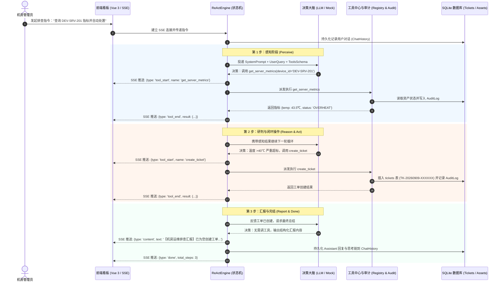

# 阶段二：手写 ReAct 状态机调度引擎算法设计与形式化推导（毕业设计论文底稿）

> **所属章节**：毕业论文 第四章 核心调度算法与系统详细设计 -> 4.1 基于轻量级 ReAct 架构的智能运维调度算法  
> **面向专业**：计算机科学与技术 / 软件工程 本科毕业设计  
> **归档时间**：2026-09-09  
> **核心特性**：原生 Python 白盒实现、双模容灾驱动（商业 API + 本地确定性 Mock 大脑）、全链路 AuditLog 审计拦截、SSE 流式事件标准化解构

---

## 一、 算法理论建模与形式化定义

在传统运维脚本或纯 LLM 问答系统中，推理与环境交互是割裂的。本系统基于 **ReAct (Reasoning + Acting)** 理论范式，将机房智能运维抽象为一个带有限状态转移与外部环境交互的离散时间决策过程：

定义五元组：
$$\mathcal{M} = \langle \mathcal{S}, \mathcal{A}, \mathcal{O}, \mathcal{T}, \mathcal{E} \rangle$$

1. **状态空间 $\mathcal{S}$ (State Space)**：
   $s_t = (H_t, \text{thought}_t) \in \mathcal{S}$，表示在第 $t$ 步的系统上下文。其中 $H_t$ 为会话历史序列（包含系统提示词、用户提问及历史动作与观察），$\text{thought}_t$ 为大模型或 Mock 大脑生成的内部思考推导。
2. **动作空间 $\mathcal{A}$ (Action Space)**：
   $a_t \in \mathcal{A} = \mathcal{A}_{\text{tool}} \cup \{\text{finish}\}$。
   - 若 $a_t \in \mathcal{A}_{\text{tool}}$，则为调用外部运维工具集（如 `get_server_metrics`、`create_ticket`、`borrow_asset`、`update_ticket_status`），其携带标准化参数字典 $\text{args}_t$；
   - 若 $a_t = \text{finish}$，表示决策大脑认为已完成闭环，输出最终自然语言汇报并退出状态机。
3. **环境观察空间 $\mathcal{O}$ (Observation Space)**：
   $o_t \in \mathcal{O}$，表示执行工具 $a_t$ 后由 SQLite 数据库或物理/模拟传感器反馈的客观执行结果（JSON 结构体）。
4. **状态转移函数 $\mathcal{T}$ (Transition Function)**：
   $$\mathcal{T}: \mathcal{S} \times \mathcal{A} \times \mathcal{O} \rightarrow \mathcal{S}$$
   更新后的会话上下文：
   $$H_{t+1} = H_t \circ \langle \text{assistant}, \text{thought}_t, a_t \rangle \circ \langle \text{tool}, o_t \rangle$$
5. **步数终止界限 $\mathcal{E}$ (Execution Bound)**：
   定义最大调度步数 $K = \text{REACT\_MAX\_STEPS}$（系统缺省为 6 步）。当迭代步数 $t \ge K$ 时强制截断，以杜绝多步循环震荡与死锁风险。

---

## 二、 算法伪代码描述 (Algorithm Formulation)

以下算法伪代码可直接排版入毕业论文正文（支持转换至 LaTeX `algorithmic` 环境）：

```text
================================================================================
Algorithm 1: Lightweight ReAct Dispatching Engine for Lab Operations
================================================================================
Input: 
  - user_query: 用户运维指令输入
  - tools_registry: 注册中心工具函数集合及对应的 JSON Schema
  - max_steps: 最大允许推理步数 (缺省为 6)
  - session_id: 当前会话标识符
  - db_session: SQLAlchemy 关系型数据库会话

Output:
  - final_response: 向管理员呈现的结构化排查汇报与操作总结
  - trace_events: SSE 标准事件流序列

1:  trace_id ← GenerateUniqueTraceID()
2:  PersistUserMessage(db_session, session_id, user_query)
3:  messages ← [SystemPrompt(SYSTEM_PROMPT), UserMessage(user_query)]
4:  step ← 0
5:  accumulated_thought ← EmptyList()
6:
7:  while step < max_steps do
8:      step ← step + 1
9:      decision ← BrainInference(messages, tools_registry)  // 双模调用 (API / Mock)
10:     
11:     if decision.thought is not Empty then
12:         accumulated_thought.Append(decision.thought)
13:         EmitSSEEvent(type="think", data={"thought": decision.thought, "step": step})
14:     end if
15:
16:     if decision.has_tool_calls then
17:         for each tool_call in decision.tool_calls do
18:             tool_name ← tool_call.name
19:             tool_args ← tool_call.arguments
20:             EmitSSEEvent(type="tool_start", data={"name": tool_name, "args": tool_args, "step": step})
21:             
22:             // 统一安全派发与自动审计
23:             observation ← ExecuteTool(tool_name, tool_args, db_session, trace_id)
24:             RecordAuditLog(db_session, trace_id, tool_name, tool_args, observation)
25:             
26:             EmitSSEEvent(type="tool_end", data={"name": tool_name, "result": observation, "step": step})
27:             
28:             // 将工具调用行为与观察结果注入会话上下文
29:             messages.Append(AssistantMessage(tool_calls=[tool_call]))
30:             messages.Append(ToolMessage(tool_name=tool_name, content=SerializeJSON(observation)))
31:         end for
32:         continue  // 继续进入下一轮推理研判
33:     else
34:         final_response ← decision.content
35:         EmitSSEEvent(type="content", data={"text": final_response})
36:         break  // 完成闭环，退出循环
37:     end if
38: end while
39:
40: if step >= max_steps and final_response is Empty then
41:     final_response ← "【系统提示】达到最大推理步数上限，已安全截断保护。"
42:     EmitSSEEvent(type="content", data={"text": final_response})
43: end if
44:
45: PersistAssistantMessage(db_session, session_id, final_response, Join(accumulated_thought))
46: EmitSSEEvent(type="done", data={"total_steps": step, "session_id": session_id, "trace_id": trace_id})
47: return final_response
================================================================================
```

---

## 三、 状态机转移时序图 (Mermaid Sequence Diagram)

以典型场景 **“查询 DEV-SRV-201 指标，若异常自动创建紧急工单”** 为例，状态机流转时序如下：



---

## 四、 核心设计亮点与软工考量（答辩应答点）

1. **拒绝黑盒与可解释性**：
   - 不依赖 LangChain 或 AutoGen 等臃肿第三方封装；
   - 核心代码约 150 行，完全基于 Python 原生循环与生成器构建；
   - 每个状态迁移点均有明确的条件分支与事件触发，代码可读性与可调试性极强，毕业答辩时可直接向评委展示源码逻辑。
2. **业务双向真实联动（非 API 套壳）**：
   - 工具调用不仅仅在控制台打印日志，而是真实透过 SQLAlchemy 2.0 映射写入 SQLite `tickets`、`assets`、`audit_logs` 表；
   - 前端可在接收到对应事件后实时刷新右侧看板数据，实现真正的双向状态闭环。
3. **高可用双模容灾体系**：
   - 遵循 KISS 与容灾工程原则，设计了 `MockDecisionBrain`；
   - 在远程商业 API 密钥失效、网络欠费或答辩离线断网的极端环境下，系统自动无感降级至确定性规则推理大脑，保证 100% 流程自闭环，答辩演示“零翻车”。
